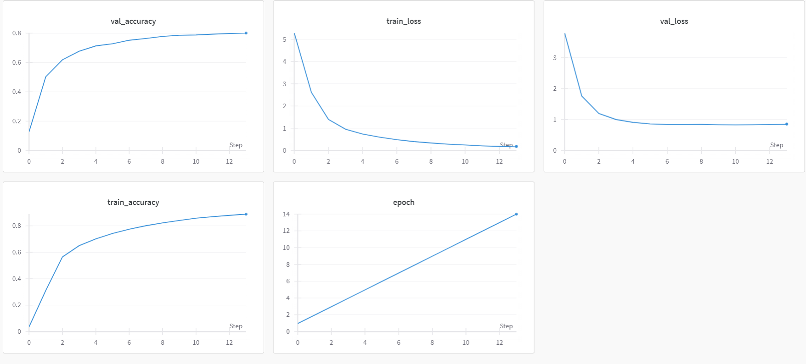

# Product Categorization and Analysis

This project aims to re-categorize products based on their title and extract various dimensions and colors associated with them. It leverages machine learning models for categorization and provides visualization tools for comprehensive analysis.

## Directory Structure

- `notebooks/`: Comprises Jupyter notebooks for visualization, algorithm testing, and feature extraction, focusing on product dimensions, colors, and other attributes.
- `BI/`: Contains Power BI dashbord files.

## Installation Instructions

Follow these steps to set up the project environment and install the required libraries:

1. **Python Installation**: Ensure Python 3.10 is installed on your system.
2. **Clone Repository**: Clone the project repository to your local machine.
3. **Install Dependencies**: Use the command `pip install -r requirements.txt` to install necessary libraries listed in the `requirements.txt` file.
4. **Project Setup Complete**: You now have all the tools and libraries needed to run the project and delve into product categorization and analysis.

## Categorization Process

The project employs machine learning models, including MultinomialNB, LightGBM, and CamemBERT, to categorize products. For CamemBERT, it is advisable to run only the `camabert_infer.ipynb` notebook.

### CamemBERT Instructions

- `camabert_trainer.ipynb`: Trainer notebook for the CamemBERT model, trained on Kaggle using a GPU. It's not necessary to run this notebook as it details the training approach.
- `camabert_infer.ipynb`: Inference notebook for predictions using CPU or GPU. Note that CPU execution may be slow for medium/large datasets.

### Model Metrics 

## Troubleshooting

- **NLTK**: If missing stopwords or punkt, download them using `nltk.download('stopwords')` or `nltk.download('punkt')`.
- **PyTorch**: For GPU systems, download the GPU version of PyTorch; otherwise, the CPU version suffices for inference. Use `torch.cuda.is_available()` to check for GPU availability.